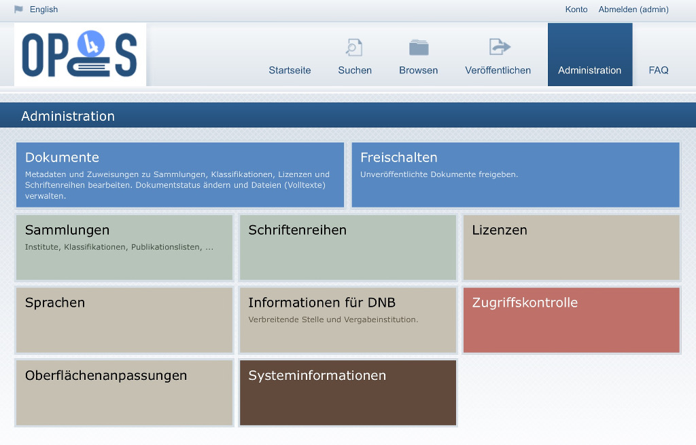

# Administration

{:width="640px"}

Der Bereich ist nur angemeldeten Nutzern mti entsprechenden Rechten zugänglich. Im folgenden werden die einzelnen
administrativen Funktionen genauer beschrieben.

## Dokumente

Der Bereich ist das Herzstück der Administration. Unter diesem Punkt können sowohl die Metadaten
der einzelnen Dokumente bearbeitet, als auch die Zuweisungen zu Sammlungen, Klassifikationen,
Lizenzen und Schriftenreihen vorgenommen und verändert werden. Darüber hinaus kann hier der
Dokumentstatus geändert und die Dateien (Volltexte) verwaltet werden.

* [Mehr](documents.html)
{: class="navlist" }

## Freischalten

Im Bereich Freischalten können berechtigte Personen mehrere Dokumente gleichzeitig für den öffentlichen Zugriff
freischalten bzw. ablehnen.

* [Mehr](review.html)
{: class="navlist" }

## Sammlungen

* [Mehr](collections.html)
{: class="navlist" }

## Schriftenreihen

* [Mehr](series.html)
{: class="navlist" }

## Lizenzen

Hier können die in OPUS 4 verfügbaren Lizenzen verwaltet werden.

* [Mehr](licences.html)
{: class="navlist" }

## Sprachen

Verwaltung der Sprachen, die im Repositorium für Dokumente verwendet werden können.

* [Mehr](languages.html)
{: class="navlist" }

## Informationen für DNB

Verwaltung der Institute, die als veröffentlichende oder verleihende Stelle für Arbeiten eingetragen werden können.

* [Mehr](institutes.html)
{: class="navlist" }

## Zugriffskontrolle

Hier kann der Zugriff auf einzelen Module und Funktionen verwaltet werden.

* Nutzerkonten
* Nutzerrollen
* IP-Adressbereiche
^
* [Mehr](security.html)
{: class="navlist" }

## Oberflächenanpassungen

In diesem Bereich können die Inhalte des Userinterface angepasst werden.

* Benutzerdefinierte Felder (EnrichmentKeys)
* FAQ-Seite
* Statische Seiten
* Übersetzungen
^
* [Mehr](userinterface.html)
{: class="navlist" }

## Systeminformationen

In diesem Bereich der Administration können verschiedene Systeminformationen abgerufen werden.

* Systemparameter
* OAI-Links
* Veröffentlichungsstatistik
* Job-Verarbeitung
* Verwaltung des Solr-Index
* Dokumenttypen
^
* [Mehr](info.html)
{: class="navlist" }
